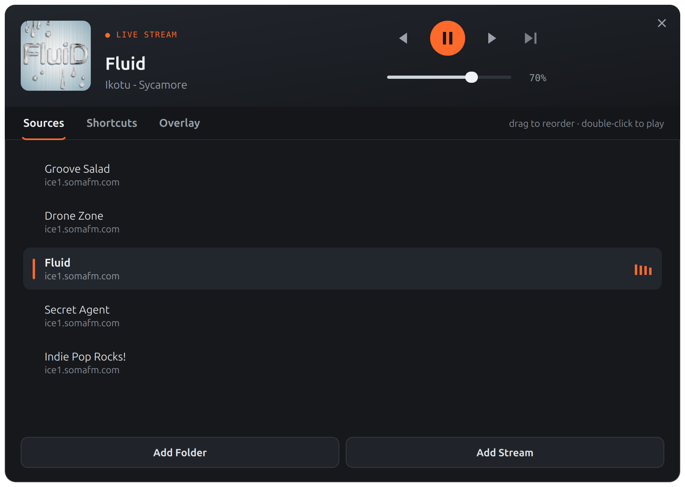

# ShortCutRadio

**A radio and music player that stays out of your way. It lives in a corner
of the screen and you drive it with the keyboard. Free, MIT-licensed, no
account, no telemetry.**



I wanted music or internet radio while I play or work, without alt-tabbing to
a player every time I want the next station. ShortCutRadio works like the GPU-stats
overlay some graphics drivers have. Press a key and a small card appears in a
corner of the screen showing what's playing. Change station, skip a track or
turn the volume up from the keyboard. Press the key again and it's gone.


## What it's good at

- **Stays on top of everything**, fullscreen games included. The card lets
  your clicks through, so it never gets in the way.
- **Shortcuts that don't steal your keys.** They only work while the overlay
  is showing. Hide it and every key goes back to your other apps, as if
  ShortCutRadio weren't there.
- **Internet radio made easy.** Paste a station's website and ShortCutRadio finds
  its streams for you. If a stream drops, it reconnects on its own.
- **Your own music folders**, played in order or shuffled, with their cover art.
- **Station logos** are found automatically. If a guess is wrong, set your own
  picture with a right-click.
- **Fits into the desktop:** media keys, the system sound menu, a tray icon,
  and a dark or light look.

## How you use it

1. **Sources** tab: add internet stations (**Add Stream**) or music folders
   (**Add Folder**).
2. **Shortcuts** tab: pick your keys. The defaults are small and out of the
   way: `[` `]` for volume, `;` `'` for the previous or next station,
   `\` to play or pause.
3. Press **Ctrl+Alt+R** to show the overlay. Now your shortcuts work.
4. **Overlay** tab: choose the corner, size, font and colours of the card.

Closing the window keeps ShortCutRadio running in the tray. Click the tray icon to
bring the window back.

## Run it

ShortCutRadio runs on **Linux with X11** today (Linux Mint, Ubuntu and similar).
You need Python 3.10 or newer and the mpv player library.

```bash
sudo apt install libmpv2 python3-venv git
git clone https://github.com/msvdm/ShortCutRadio.git
cd ShortCutRadio
python3 -m venv .venv
.venv/bin/pip install -r requirements.txt
.venv/bin/python shortcutradio.py
```

- `shortcutradio.py --hidden` starts it straight in the tray, which is handy for
  autostart.
- **Portable mode:** put an empty file named `shortcutradio.portable` next to
  `shortcutradio.py`, and the settings will live in a `data` folder inside the app
  folder instead of your home folder. Then the whole folder can move to
  another machine.

## Status

It works well on Linux (X11) and I use it every day. Next on the list:
ready-made downloads, then Windows and macOS. Wayland isn't supported,
because the global shortcuts need X11.

## Who wrote this

Claude, Anthropic's AI model, writes the code. I'm a sound engineer, not a
programmer: I decide what ShortCutRadio should do, test every change on my own
machine, and say when something is wrong. The reasons behind the design, and
the bugs we hit along the way, are written down in [CLAUDE.md](CLAUDE.md).

## Problems and ideas

Please open an [issue](https://github.com/msvdm/ShortCutRadio/issues). Say what you
expected, what happened, and which Linux and desktop you use.

## License

MIT, see [LICENSE](LICENSE). Use it, change it, share it; just keep the
copyright notice.
