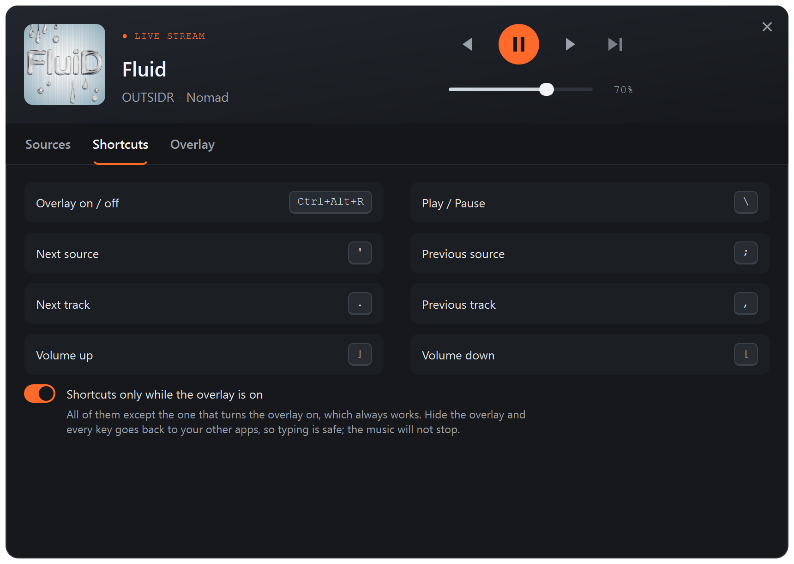
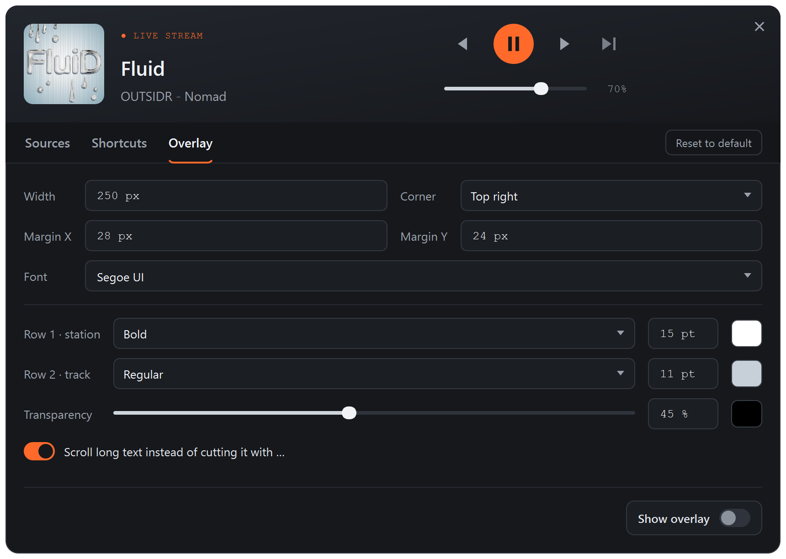

# ShortCutRadio

**A radio and music player with overlay and easy keyboard shortcuts.**


Hi, :)  
I am a sound guy first, geek second and a software engineer never.
Everything in this repo is written by Opus 5.5. I just tested and prompted until I liked it.
If that is a hard stop for you - do not waste your time reading the rest.

You're welcome :))

Now that we have that out of the way, let me try to explain what this app is.
I was tired of listening to the same tracks inside each game.
I wanted music or internet radio while I play, without alt-tabbing to
a player or web browser every time I want the next station. And I know that some games allow you
to add your own songs, but that is too much work for each game at a time.

ShortCutRadio lets you create a playlist of sources - both internet streams and local/network folders,
that stay with you on every game, app or just general work. Once you start and configure it, 
it can live in your system tray and just wait for you to turn it on. 
It does not interfere with other players, browsers or apps.
Press a key combo that you define in the settings and a small overlay card appears in a
corner of the screen showing what's playing. Pause/play, change station, skip a track or
turn the volume up from the keyboard. Press the key again and it's gone.


## What it's good at

- **Stays on top of everything**, fullscreen games included (on Windows,
  in the game's borderless mode). The card lets your clicks through, so it
  never gets in the way.
- **Shortcuts that don't steal your keys.** They only work while the overlay
  is showing. Hide it and every key goes back to your other apps, as if
  ShortCutRadio weren't there. Or switch that off, and shortcuts like
  Ctrl+E work all the time, overlay or not.
- **Internet radio made easy.** Paste a station's website and ShortCutRadio finds
  its streams for you. If a stream drops, it reconnects on its own.
- **Your own music folders**, played in order or shuffled, with their cover art.
- **Station logos** are found automatically. If a guess is wrong, set your own
  picture with a right-click.
- **Fits into the desktop:** media keys, the system sound menu, a tray icon,
  and a dark or light look.

## How you use it

1. **Sources** tab: add internet stations (**Add Stream**) or music folders
   (**Add Folder**).
2. **Shortcuts** tab: pick your keys.

   Only the Overlay on/off one needs a complicated 3 keys shortcut to avoid
   duplication with the system. It's not ok to be Ctrl+C if you want it to work correctly :)
   The rest of the shortcuts can be simple and single keys, like the defaults:
   `[` `]` for volume, `;` `'` for the previous or next station, `\` to play or pause.
   In the default state these shortcuts work only while the overlay card is on,
   so they do not collide with your work.

   

   A favorite station can have a key of its own: right-click it on the
   **Sources** tab and choose **Shortcut…**. The key shows on the right of
   its row and follows the same rules as the other shortcuts.

3. Press **Ctrl+Alt+R** to show the overlay. Now your shortcuts work.
   Want them to work all the time, like any other app's? Turn off
   **Shortcuts only while the overlay is on** at the bottom of the Shortcuts
   tab. Then every shortcut needs Ctrl, Alt or Win/Super (Ctrl+E,
   Alt+Shift+K and so on), so a single key never gets in the way of typing.
4. **Overlay** tab: choose where the card sits (the corner, and the monitor
   if you have more than one), its size, font and colours.

   

Closing the window keeps ShortCutRadio running in the tray. Click the tray icon to
bring the window back.

## Run it

ShortCutRadio runs on **Linux with X11** (Linux Mint, Ubuntu 22.04 or newer
and similar) and on **Windows 10 and 11**.

### Download

Get it from the [latest release](https://github.com/msvdm/ShortCutRadio/releases/latest).
Everything it needs is inside; there is nothing else to install.

**Windows:**

- **`ShortCutRadio-*-windows-x64-setup.exe`**, the installer, is the one
  most people want. It puts ShortCutRadio in the Start menu, needs no
  administrator rights, and uninstalls from Settings > Apps. Your settings
  stay when you uninstall.
- **`ShortCutRadio-*-windows-x64.zip`**, a portable folder. Unzip it anywhere
  and run `shortcutradio.exe` inside. It keeps its settings in the folder.

The installer isn't signed yet, so Windows may warn that it comes from an
unknown publisher: choose **More info**, then **Run anyway**.

On Windows the keyboard's media keys are ordinary shortcuts: bind Play/Pause
to one and, while your shortcuts work (overlay on, or always), it controls
ShortCutRadio and nothing else. ShortCutRadio also shows up in the volume menu and on the lock screen.

**Games on Windows.** Some games run as administrator. Windows then keeps
their keys from every program that doesn't, so ShortCutRadio's shortcuts do
nothing in them. Turn on **Run as administrator** at the bottom of the
Shortcuts tab: ShortCutRadio starts again with those rights, and Windows asks
your permission each time it starts. A game in *exclusive fullscreen* can
hide the card or make it flicker; choose the game's borderless or "windowed
fullscreen" mode if it has one.

**Linux:**

- **`shortcutradio_*_amd64.deb`**, the one most people want. Double-click it
  to install, and ShortCutRadio appears in your menu. Remove it the same way
  as any other program.
- **`ShortCutRadio-*-linux-x64.tar.gz`**, a portable folder. Unpack it
  anywhere and run `shortcutradio` inside. It keeps its settings in the
  folder, so it can live on a USB stick.

Started with `--hidden`, ShortCutRadio goes straight to the tray, which is
handy for autostart.

### From the source code

On Linux you need Python 3.10 or newer.

```bash
sudo apt install python3-venv git
git clone https://github.com/msvdm/ShortCutRadio.git
cd ShortCutRadio
python3 -m venv .venv
.venv/bin/pip install -r requirements.txt
.venv/bin/python shortcutradio.py
```

- **Portable mode:** put an empty file named `shortcutradio.portable` next to
  `shortcutradio.py`, and the settings will live in a `data` folder inside the app
  folder instead of your home folder. Then the whole folder can move to
  another machine.
- **Build the downloads yourself:** `packaging/build.sh` on Linux makes the
  `.deb` and the `.tar.gz` in `dist/`; `packaging\build.ps1` on Windows
  makes the installer and the `.zip` (it needs
  [Inno Setup 6](https://jrsoftware.org/isinfo.php)).

## Status

It works well on Linux (X11) and I use it every day. On Windows it works,
in games too; over a game in exclusive fullscreen the card can still flicker
(see "Games on Windows" above).
macOS is next.

On Linux with Wayland the player works but the shortcuts don't: they need
X11. Choose the Xorg (X11) session on the login screen, usually under a
small gear or menu next to your name.

## Who wrote this

Claude Opus 5.5, Anthropic's AI model, writes the code. I'm a sound engineer, not a
programmer: I decide what ShortCutRadio should do, test every change on my own
machine, and say when something is wrong. The reasons behind the design, and
the bugs we hit along the way, are written down in [CLAUDE.md](CLAUDE.md).

## Problems and ideas

Please open an [issue](https://github.com/msvdm/ShortCutRadio/issues). Say what you
expected, what happened, and which Linux and desktop, or which Windows, you
use.

If something went wrong, please attach ShortCutRadio's log file,
`shortcutradio.log`. It is in `%APPDATA%\ShortCutRadio` on Windows, in
`~/.config/ShortCutRadio` on Linux, or in the `data` folder of a portable
copy. The one before it, if there is one, is `shortcutradio.log.1`.

## License

MIT, see [LICENSE](LICENSE). Use it, change it, share it; just keep the
copyright notice.
